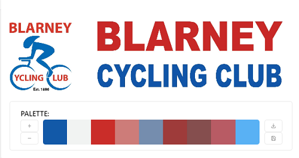
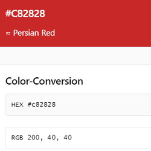
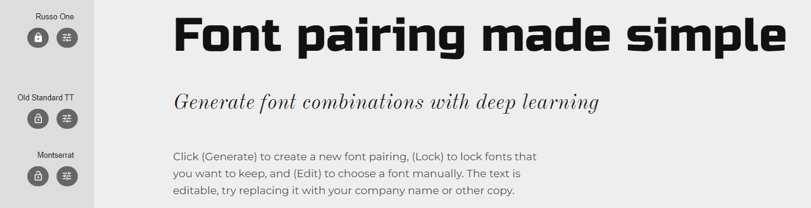
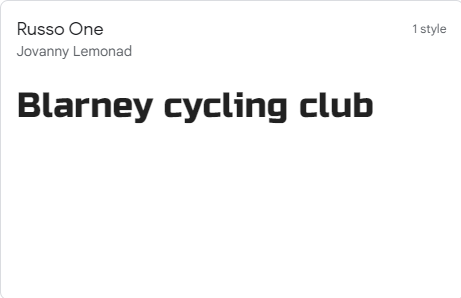
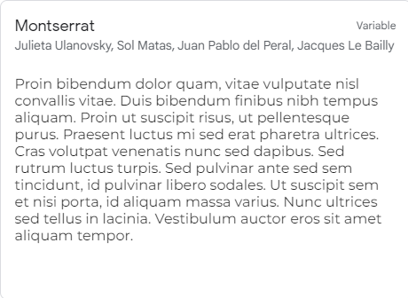
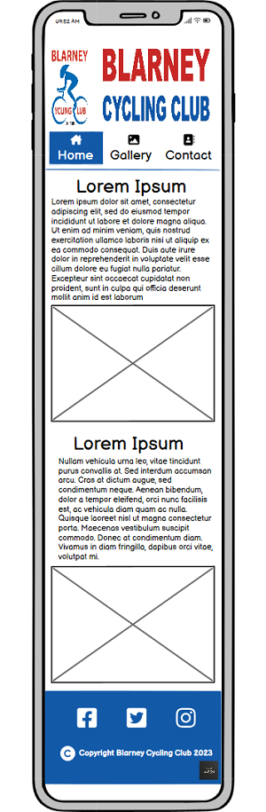
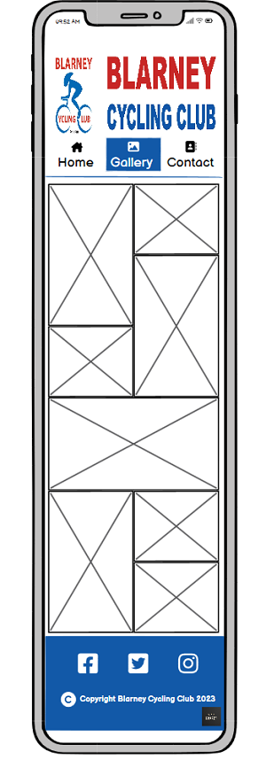

# Blarney Cycling Club

Blarney cycling club is a website for real life cycling club based in Blarney, Co. Cork. Blarney CC mainly caters for all different types of cycling with a main emphasis on road cycling. Club was founded in 1886 and has been quite active in the community ever since. The club organizes one sportiff/charity cycle and three or more road racing events every year. This website will be a very useful contact point for people not on social media. Also great advertisement and information point for the events coming up or new cyclists hoping to contact the club.

The link to the live website can be found [here.](https://inc21.github.io/blarney_cc_pp1/)

# User Stories

### First-time user objectives

- As a first-time user, When I first open the page I want to be confirmed visually that I am on the right page.
- As a first-time user, I want to easily navigate my way around the site. 
- As a first-time user, I want to be able to see what this club is all about, learn more and send them a message.
- As a first-time user, I want to be inspired by the photographs on the page to get out and healthy.
- As a first-time user, I want to be able to find the club location.

### Returning user objectives

- As a returning user, I would like to navigate to the right page quickly and easily.
- As a returning user, I would like to find the location for the group cycle coming up.
- As a returning user, I would like to find out and maybe download information about the upcoming event.
- As a returning user, I would like to see if there are any cancellations due to weather for the upcoming group cycle.

###  Site owner objectives
- As a site owner, I would like the website to provide information to an even wider range of people about the club and its activities.
- As a site owner, I would like to attract more people to cycling.
- As a site owner, I would like to provide that information in a clean and easily manageable manner.

# Design

## Colour

For this, well-established cycling club it was important to pick colours that are consistent with their original club logos and cycling kit.
The two main colours are Tory Blue and Persian Red 

 

## Font
Used Google fonts to import the font styles and  [fontjoy.com](https://fontjoy.com/) 

**Russo one - regular 400 - for headings and larger text.**

__Montserrat - regular 400 - for paragraphs and other text__

- Fall back font in both cases is Sans-serif.

## Wireframe
### Wireframe for larger screens.

__Home Page__

__Gallery Page__

__Contact Page__

 

### Wireframe for smaller mobile screens.

  
  
  
 

# Tools and technologies used
## Languages
<ul>
  <li>HTML</li>
  <li>CSS</li>
</ul> 

## Other tools and programs.
<ul>
  <li><a href="https://balsamiq.com/" target="_blank">Balsamiq</a> was used for wireframing.</li>
  <li><a href="https://code.visualstudio.com/" target="_blank">Visual Studio Code.</a> Did most of my coding and synchronizing with GitHub with VS Code.</li>
  <li><a href="https://git-scm.com/" target="_blank">Git</a> for version control.</li>
  <li><a href="https://github.com/" target="_blank">GitHub</a> for hosting and deploying repositories.</li>
  <li><a href="https://fontawesome.com/" target="_blank">Font Awsome</a> for icon images.</li>
  <li><a href="https://imagecolorpicker.com/" target="_blank">imagecolorpicker.com</a> free online tool to pick the colors from the original logo.</li>
  <li><a href="https://fonts.google.com/" target="_blank">Google Fonts</a> was used to import the fonts</li>
  <li><a href="https://fontjoy.com/" target="_blank"> Font Joy</a> for font pairing.</li>
  <li><a href="https://www.grammarly.com/" target="_blank"> Grammarly</a> was used to double-check spelling mistakes.</li>
  <li><a href="https://www.createmockup.com/" target="_blank"> Createmockups.com</a> Responsive website mockup screenshot generator.</li>

## Features 

### Existing Features

- __Header of the page__

  - Featured on all three pages, the full responsive navigation bar includes a link on the Logo image to the home page. The header on the home page, gallery and contact page are identical to allow for easy navigation.
  - This section will allow the user to easily navigate from page to page across all devices without having to revert to the previous page via the browser ‘back’ button.  

   

   

- __Home page__

  - The home page includes a photograph and an about us section to allow the user to see information about the club and its history. 
  - This page is the first-page user sees when coming to the page with an eye-catching hero image to make them investigate further.  

 

- __The Footer__ 

  - The footer section is again featured on all the pages and includes links to the relevant social media sites for Blarney Cycling Club. The links will open to a new tab to allow easy navigation for the user. 
  - The footer is valuable to the user as it encourages them to keep connected via social media.

  

 

- __Gallery__

  - In the gallery section user can find more motivational images from the club activities. 
  - This section is valuable to the user as they will be able to easily identify the types of events Blarney cycling club organizes and takes part in.   

 

- __The Contact Page__

  - This page will allow the user to contact the club via the form. Also, find the location for all organized weekly meetups.
  - This page is very valuable for the user with many points of contact that can be found. 

 

- __The Confirmation Page__

  - This page will confirm to the user that the contact form was sent successfully.
  - This page is very valuable for the user as it confirms that their action was completed as requested. 

 

- __The Error 404 Page__

    Read more [GitHub custom 404 page](https://docs.github.com/en/pages/getting-started-with-github-pages/creating-a-custom-404-page-for-your-github-pages-site)
  - This page will be displayed if any user manages to navigate to a page that does not exist.
  - Mistakes happen, this page is very valuable for the user as it shows their error whilst still keeping them on the page with easy navigation back to the home page. 

 

### Features Left to Implement

- Full club history page. The club historian has been collecting old photos and articles about the club since the start and the history page would be a great way to publicize this.
- Events page. As mentioned earlier Blarney CC is a very active cycling club and runs many events. This page would be a very valuable place for marketing these events and for users to find more info about the event.
- Registration page for events.

## Look and feel
  - The look of this website is very consistent in all different browsers tested including Google Chrome, Mozilla Firefox, Apple Safari and Microsoft Edge. 

## Testing 

This website was tested on as many different devices as I was able to find. Including a Dell laptop and desktop pc, iPads 6th and 10th generation, and iPhone SE, iPhone 12 and iPhone 13. Also used a program called [Grammarly](https://www.grammarly.com/) to check for any spelling or typing errors. Detailed actions are listed below. Additionally conducted Google lighthouse and W3C validator testing, results for them are below.
Also made sure that the website is clear, easy to use and valuable for the user.

## Link testing
| Action | Expected Result | Actual Result |
|---|---|---|
| Click on website url: [https://inc21.github.io/blarney_cc_pp1/](https://inc21.github.io/blarney_cc_pp1/) | Open 'Home Page' of the website | Working as expected |
- ### Header and navigation bar.
| Action | Expected Result | Actual Result |
|---|---|---|
| Click on the logo image in the header section. | Reload or move to 'Home Page' | Working as expected |
| Click on navigation bar 'Home' button | Reload or move to 'Home Page' | Working as expected |
|  Click on navigation bar 'Gallery' button | Load 'Gallery Page' | Working as expected |
|  Click on navigation bar 'Contact' button | Load 'Contact Page' | Working as expected |
|  Click on 'contact' in 'About' section | Load 'Contact Page' | Working as expected |
- ### Footer at the bottom of the page and social media links.
| Action | Expected Result | Actual Result |
|---|---|---|
| Click on Facebook icon (first from left) | Open Blarney CC Facebook page in new window | Working as expected |
| Click on Twitter icon (second from left) | Open Blarney CC twitter page in new window | Working as expected |
| Click on Instagram icon (Third from left) | Open Blarney CC Instagram page in new window | Working as expected |
| Click on strava icon (first from left) | Open Blarney CC Strava page in new window | Working as expected |

- ### Form testing, Contact page.
| Action | Expected Result | Actual Result | Image |
|---|---|---|---|
| on the 'Contact Page' press the 'Submit' button without filling out the form. | Browser to display a warning on the line where user input is required | Working as expected |  |
| on the 'Contact Page' in the email input field enter some other text and hit the 'Submit' button | Browser to display a warning on the email input field about missing @ symbol| Working as expected |  |
| Form filled with the marked required text. | Open the 'Confirmation Page' to confirm with the user about the successful form submission. | Working as expected |   |

- ### Confirmation and 404-page testing.
| Action | Expected Result | Actual Result | Image |
|---|---|---|---|
| on 'Confirmation Page' click anywhere on the big red line of text 'Click here to go back to the home page' | Site to load 'Home Page' | Working as expected |  |
| on '404 Page' click anywhere on the big red line of text 'Click here to go back to the home page' | Site to load 'Home Page' | Working as expected |  |

- This website was created with only two main colors and with no big images. This makes the page very easy on the eyes of the end-user and quick to load.

- Also used Google dev tools to test responsiveness on smaller screens and with throttling on for low-end and mid-tier mobiles. The website was able to load with no considerable page loading times even on low-end mobile.

### Validator Testing 

- HTML
  - Some errors were returned when passing through the official [W3C validator](https://validator.w3.org/nu/?doc=https%3A%2F%2Fcode-institute-org.github.io%2Flove-running-2.0%2Findex.html). Mainly typing mistakes and elements left open or closed with double marks. All errors were immediately fixed. 
- CSS
  - Some errors were found when passing through the official [(Jigsaw) validator](https://jigsaw.w3.org/css-validator/validator?uri=https%3A%2F%2Fvalidator.w3.org%2Fnu%2F%3Fdoc%3Dhttps%253A%252F%252Fcode-institute-org.github.io%252Flove-running-2.0%252Findex.html&profile=css3svg&usermedium=all&warning=1&vextwarning=&lang=en#css). All errors were immediately fixed. 
  

    

- Google Lighthouse. Testing was performed in private browsing mode.
 

 

 

## Interesting bug or problems.
  - An existing logo that had to be used for this website meant that the colours that I could use were very limited. This and my lack of experience in design and coding made this project an interesting problem that had to be solved.
  - Used css grid for the layout. Trying to match different elements on the page was a big learning curve.
  - Another interesting problem to solve was getting labels on the form page to render on top of input fields.
  - Blarney Cycling Club had two Twitter accounts, during the final stages of testing account that was linked on this website was deleted. All pages are updated with the correct url.
  - Another problem discovered during my local testing with different iPhones and iPads, was the logo image not resizing correctly when you turn the phone horizontally. It was like some bottom part of the image was cut off. Quite happy about the solution. Did some searching on the web for potential solutions and I could see this question asked before. I could only test this on the live site so had to do a few commits to get this right. Found no solution but it got me thinking. My solution was, the original logo was 1100x800px and only needed it to be 130px at the highest so resized the image locally and did a commit. Problem still exsisted. After looking at this with dev tools looked like the image was hidden behind a white margin. Assigned position relative and z-index to the container and the problem was solved.

## Unfixed Bugs

After rigorous testing with various online tools and my limited testing with different devices and browsers, all known warnings and errors returned were rectified.

## Deployment

### Deploy with GitHub Pages.

 The steps to deploy are as follows: 
  - On my [GitHub](https://github.com/Inc21) profile page, top centre of the screen click on repositories.
  - Click on blarney_cc_pp1
  - In the blarney_cc_pp1 repository, navigate to the Settings tab.
  - Menu list on the left of the screen, navigate to the pages tab. 
  - From the GitHub pages, branch section drop-down menu, select the main Branch and hit the save button.
  - Once the main branch has been selected, the page will be automatically refreshed with a detailed ribbon display to indicate the successful deployment. 

The live link can be found here - https://inc21.github.io/blarney_cc_pp1/ 

### Local Deployment
The steps to deploy are as follows:
  - On my [GitHub](https://github.com/Inc21) profile page, top centre of the screen click on repositories.
  - Click on blarney_cc_pp1
  - In the blarney_cc_pp1 repository, click on the 'Code' button.
  - Menu that opens copy to clipboard: https://github.com/Inc21/blarney_cc_pp1.git
  - on a Windows machine, open the command prompt (press windows+R to open the "Run" box. Type "cmd" on then click ok).
  - In cmd type "git clone" and paste the link you copied earlier (ctrl+V). Example: git clone https://github.com/Inc21/blarney_cc_pp1.git

### Fork repository
  - To fork a repository that is not yours
  - Click on the 'Fork' button on the top right of the screen
  - On the 'Create a new fork' page you are given the option to rename that repository and then click on the green 'Greate fork' button at the bottom of the form.

# Credits 

No part of any of the code used on this website was copied and pasted from anywhere. [Code Institute's](https://codeinstitute.net/ie/) 'Love Running' project and various other online tutorials were used to guide this learning process and get an idea of how to apply the concepts to this website. 

[Code Institute's](https://codeinstitute.net/ie/) - 'Love Running'. Was used quite a lot as a reference. 
My mentor Dick Vlaanderen. He is a great help and every time we speak my head is bursting with new ideas on how to proceed. I'd say this man has some great stories to tell also.

YouTube tutorials created by: 
<a href="https://www.youtube.com/@Code_Entropy">Code Entropy</a> 
<a href="https://www.youtube.com/@dcode-software">dcode</a> 
<a href="https://www.youtube.com/@Tech2etc">Tech2 etc</a> 
All repositories can be found on my [GitHub Profile.](https://github.com/Inc21?tab=repositories)

Many other websites were used for research and ideas on how to fix problems including but not limited:  
[Google](https://www.google.ie/) 
[Stack Overflow](https://stackoverflow.com/) 
[w3shools](https://www.w3schools.com/) 
[Slack](https://slack.com/intl/en-ie/) 
and many many more. 

## Content 

- Content taken from the club's public social media pages with verbal permission from the club's board.

## Media

- Photos were taken from Blarney Cycling Club's Facebook public page with verbal permission from the club's board.
- The hero image on the home page and some images on the gallery page are from [Sean Rowe](https://www.facebook.com/sean.rowe.545) - [Sportsphoto Ireland.](https://www.facebook.com/search/top?q=sportsphoto%20ireland) (both links are for Facebook pages)

